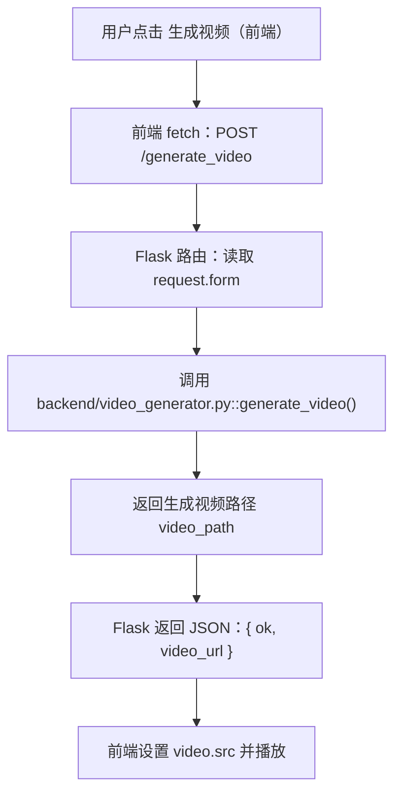

# 说话人脸生成对话系统

本项目基于[AD-NeRF模型](https://github.com/wyyalhz/Reproduce-of-AD-NeRF)和[Genie-TTS](https://github.com/High-Logic/Genie-TTS)实现（不太）实时说话人脸生成对话系统

## 系统流程



## 核心模块
- **模型文件**:./AD-NeRF存放了模型代码，同时有模型专属README，Modelscope上存放了模型docker镜像[appdocker-web.tar.gz](https://modelscope.cn/models/wyyalhz/AD-NeRF-12-02/files)
- **训练后端**: `./backend/model_trainer.py` - 负责调用模型执行训练任务
- **推理后端**: `./backend/video_generator.py` - 负责调用模型执行视频生成推理

## 使用方法

使用项目中的AD-NeRF代码并按照AD-NeRF目录下的模型专属Readme手动配置环境，或者下载模型docker镜像[appdocker-web.tar.gz](https://modelscope.cn/models/wyyalhz/AD-NeRF-12-02/files)并放入AD-NeRF解压(太大了，有10个G，不是很推荐)

1. 环境搭建：
   ```bash
   conda create -n app python=3.10
   conda activate app

   pip install flask numpy openai sniffio requests SpeechRecognition zhipuai
   ```

2. 启动部署在华为云服务器上的Genie Server
    ```bash
    # 按照Genie官网文档安装相关文件并改写FastAPI放到华为云上，此处仅为个人示例
    python genie_server.py
    ```

3. 启动应用：
   ```bash
   # 可选：将api_key添加到环境变量中实现实时聊天，此处以质谱轻言为例
   # export ZHIPU_API_KEY=YOUR_KEY
   # export ZHIPU_MODEL=glm-4-flash-250414
   python app.py
   ```

4. 本地访问应用：
   打开 http://127.0.0.1:6006/